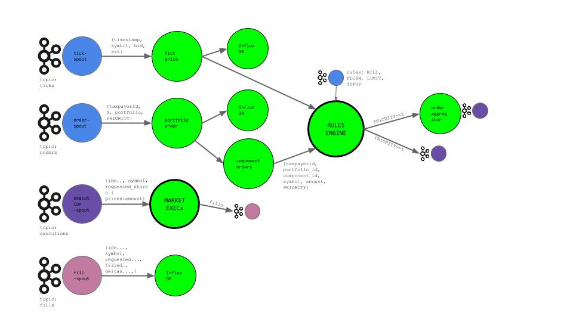
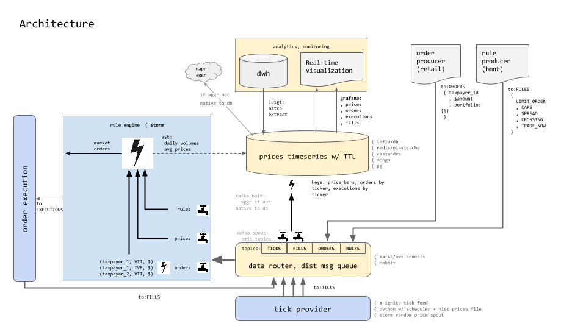

# Storm

An architectural pattern for real-time Ticks and Trading using a durable msg queue (Kafka), a distributed realtime computation system (Storm w/ python streamparse), and a time-series database (influxdb). 

To illustrate:
A segment of our Storm topology reads Ticks from the `ticks` Kafka topic. The
Kafka spout is JVM-based and defined in `src/clj/fintank/spouts/tick_spout.clj`.

The tuples emitted by this spout are JSON-formatted strings and so a Python
bolt handles deserializing the JSON. Technically, this isn't needed as the
Kafka spout is entirely capable of performing this deserialization itself using
a custom Scheme instead of the current `StringScheme`. Implementing this is a TODO.

Once deserialized, Ticks are emited to an InfluxDB bolt for persisting the tick and, in parallel, on to the Trading Rule Engine responsible for matching latest prices to orders - as the business rules permit.

### Topology, Architecture, Charting





## Streamparse
At the core of this implementation is [Streamparse](https://streamparse.readthedocs.org/en/latest/index.html) - allowing us to write Python code against Storm streams.  Gratitude to the [Parse.ly](http://www.parsely.com/) team for their fantastic tutorials and documentation - much of the scaffolding here is an elaboration on their [kafka-jvm](https://github.com/Parsely/streamparse/tree/master/examples/kafka-jvm) tutorial.

# Instructions

### 1. Install Vagrant and Virtualbox
Install [Vagrant](https://www.vagrantup.com/) and [Virtualbox](https://www.virtualbox.org/).

Install omnibus plugin:

    cd ~/src/storm
    vagrant plugin install vagrant-omnibus

### 2. Create Virtual Machine

Run `vagrant up` to create a virtual machine.

**This can take > 10 minutes and appears to hang at `Loading project definition from /vagrant/kafka-manager/project`. Be patient.**

This uses chef-solo to automatically provision it with:

- Java (openjdk 7)
- Python (2.7.5)
- pip (latest)
- virtualenv (latest)
- supervisord (latest)
- Apache Zookeeper
- Apache Storm (0.9.4)
- Kafka (0.8.1.1)
- Kafka Manager (latest)
- InfluxDB (latest)
- Grafana (latest)

This will take a few minutes to fully provision the server. Once provisioned,
this server will have the following services accessible at `192.168.50.50`:

- Zookeeper: 2181
- Storm UI: 8080 <http://192.168.50.50:8080/index.html>
- Storm Nimbus (Thrift): 6627
- Storm DRPC: 3772
- Storm DRPC Invocations: 3773
- Storm Logviewer: 8000 <http://192.168.50.50:8000>
- Kafka: 9092
- Kafka Manager (yahoo): 9000 <http://192.168.50.50:9000>
- InfluxDB: 8083 (ui) <http://192.168.50.50:8083>, 8086 (api)
- Grafana: 3000

### 3. Modify /etc/hosts

In order to ensure that the settings within the VM work for both the
`sparse run` and `sparse submit` commands, you'll need to modify your
`/etc/hosts` file and add the following line:

```
192.168.50.50 streamparse-box
```

### 4. Setup ssh config

In order to `sparse submit` topologies to the Storm cluster running in your
virtual machine, streamparse requires ssh access to the box. Unfortunately,
vagrant uses some clever tricks when it executes `vagrant ssh` that we need to
copy. In order to allow streamparse to ssh into the box, we need to modify your
ssh config. Note that if you only wish to run this example via `sparse run`,
this step isn't necessary.

Run this command to append the necessary info to your local `~/.ssh/config`.

```
echo >> ~/.ssh/config && vagrant ssh-config | sed -e 's/Host default/Host streamparse-box/' -e 's/HostName 127.0.0.1/HostName 192.168.50.50/' -e 's/Port 2222/Port 22/' -e 's/LogLevel FATAL/LogLevel INFO/' >> ~/.ssh/config
```

You can confirm that ssh is configured properly by running `ssh streamparse-box`
which should allow you to ssh into your new virtual machine without Vagrant.

### 5. Restart virtual machine

SSH-ing into the box seemed to indicate a restart was required:

    vagrant halt && vagrant up && vagrant provision

### 5. Create the `kafka_development` cluster
<http://streamparse-box:9000/addCluster>

-    Cluster Name: `kafka_development`
-    Cluster Zookeeper Hosts: `localhost:2181`

### 5. Seed the Kafka "ticks" topic

First, install necessary requirements via `pip`
(preferrably inside a virtualenv).

    brew install python
    pip install virtualenv
    cd ~/src/storm
    export PIP_REQUIRE_VIRTUALENV=true
    virtualenv pyenv
    cd pyenv
    source bin/activate
    pip install -r ../requirements.txt

Next, seed the `ticks` topic in Kafka with some sample data by running the
following command from outside of your VM:

```bash
cd ~/src/storm
source pyenv/bin/activate
invoke queue_ticks
```

By default, this will seed the topic with 100,000 randomized ticks. Ticks are
JSON-formatted strings that look something like this:

```python
{"ask": 94.190756, "timestamp": 1438539936.355217, "symbol": "IVE", "bid": 93.97388, "exchange": "NASDAQ"}
```

You may have to seed each Kafka topic.  The first time a message is submitted to a non-existing topic, Kafka may fail and abort.  Try again - the topic will be automatically created.  When the command is working properly, you'll see a message
like this:

```
Seeding Kafka (streamparse-box:9092) topic 'ticks' with 100,000 fake ticks.
Done.
```

### 6. Submit an Order or two to the "orders" topic
```bash
cd ~/src/storm
source pyenv/bin/activate
invoke queue_orders
```

If you get an error:

    kafka.common.LeaderNotAvailableError: TopicMetadata(topic='orders', error=5, partitions=[])

then retry `invoke queue_orders`.


### 6. Seed the `executions` topic:

```bash
cd ~/src/storm
source pyenv/bin/activate
invoke executions
```

### 7. Test the topology locally

If not already installed, install `lein`:

    brew install leiningen

Test the topology locally with:

```bash
cd ~/src/storm
source pyenv/bin/activate
sparse run --debug -t 15
```

It's helpful just to see the end result of this topology, so you can filter
the debug output to only those tuples emitted from the final bolt:

```bash
sparse run --debug -t 60 | grep "Emitting: tick-deserializer default"
```

If everything worked properly, you should soon see messages like:

```
31098 [Thread-27] INFO  backtype.storm.daemon.task - Emitting: tick-deserializer default ["ask": 109.899805, "timestamp": 1437423417.163825, "symbol": "VTI", "bid": 109.872953, "exchange": "NASDAQ"]
```
### 8. Whatch the dashboards refresh, live!
Visit `http://streamparse-box:3000/`.  You should see a grafana dashboard.  Import the order-flow dashboard configuration from `dashboards/Order Flow-1437489850276.json`

### 9. Test submitting the topology

Seeing as your VM also has a Storm cluster, you can submit the topology to the
Storm cluster using `sparse submit`. Navigate to the
[Storm UI](http://streamparse-box:8080/index.html) to check out it's progress!

### 10. Kafka manager
Is deployed to: `http://streamparse-box:9000/`.  Visit `http://streamparse-box:9000/clusters/kafka_development/topics` via the top-level menu and make sure you have the following topics created:
- executions
- fills
- orders
- ticks


### 11. InfluxDB
This POC uses an open-source distributed time-series db, InfluxDB - but other DB (redis, cassandra, even PG) can be plugged in instead.  InfluxDB was chosen for its feature-fulness and the elegance of its query syntax.  For example:

```
SELECT mean(ask), mean(bid) FROM "bid_ask" WHERE "symbol" = 'IVE' AND time > now - 1h GROUP BY time(1m) fill(null) ORDER BY asc
```
shows the ease with which we can display avg bid and ask prices for the last hour of tick data, over 1minute groupings.

InfluxDB comes with a web-ui: http://streamparse-box:8083/ that supports interactive querying.  For command-line interfaces, visit [InfluxDB Tools Page](https://influxdb.com/docs/v0.9/tools/shell.html)


